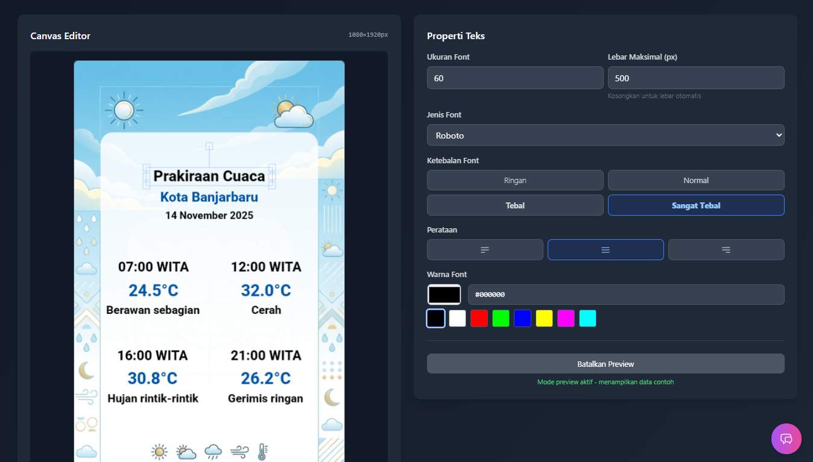
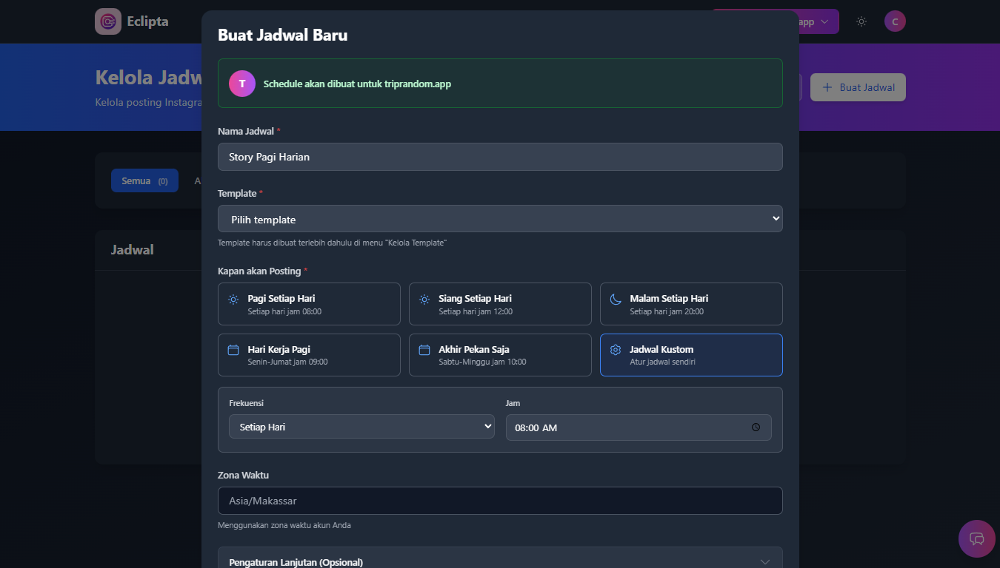

# Eclipta - Manajemen Konten Canggih

**Eclipta** adalah platform all-in-one untuk mengelola konten Instagram. Kelola beberapa akun sekaligus, brainstorming ide konten dengan AI, desain visual, sampai posting otomatis—semuanya bisa dilakukan di satu tempat. Eclipta membantu mengotomasi tugas-tugas yang biasanya memakan waktu agar kamu lebih efisien.

---

## Screenshots

### 1. Dashboard Overview

### 2. Ide Konten & AI Generator

### 3. Upload Post Feed

### 4. Editor Template

### 5. Penjadwalan Otomatis

---

## Fitur-Fitur Utama

### 1. Multi-Account Management untuk Perusahaan
* **Sistem hierarki user:** Ada role Admin yang bisa mengatur akun-akun Client. Cocok untuk perusahaan dengan banyak divisi atau cabang yang butuh akun terpisah.
* **Kelola beberapa akun Instagram sekaligus** dari satu dashboard.
* **Integrasi resmi lewat Instagram Graph API** jadi akun kamu terlindungi dan terpercaya.

### 2. Penjadwalan Upload Konten
* **Upload berbagai tipe konten:** Feed post, Story, dan Carousel (album).
* **Jadwal posting yang presisi** atur jadwal posting kapan saja, bahkan untuk beberapa bulan ke depan.
* **Upload Massal:** Upload banyak konten sekaligus dengan smart delay (jeda 2-60 menit) agar konten kamu tetap muncul di feed followers secara konsisten.
* **Draft & Calendar view:** Lihat semua konten yang dijadwalkan dalam tampilan kalender yang mudah dipahami.

### 3. Fitur AI untuk Konten
* **AI Content Planner:** Masukkan info tentang bisnis kamu, AI akan buatkan rencana konten untuk 14 hari ke depan lengkap dengan caption, hashtag, dan CTA. Setelah ide konten jadi, kamu tetap bisa edit caption atau ganti media. Yang lebih praktis lagi, ada fitur **auto-publish** jadi konten yang sudah siap bisa langsung diposting otomatis tanpa repot satu-satu.
* **AI Image Generator:** Bikin gambar langsung dari dashboard tanpa perlu tools eksternal.
* **Echa, AI Assistant:** Chat dengan asisten AI yang bisa bantu kamu kelola konten atau jawab pertanyaan tentang fitur-fitur Eclipta.

### 4. Editor Template & Posting Otomatis
* **Template editor mirip Canva:** Desain template dengan cara drag-and-drop. Upload background, atur posisi teks, semuanya tinggal klik tanpa ribet.
* **Automasi dengan data eksternal:** Punya database atau sistem sendiri? Atau mau pakai layanan pihak ketiga? Keduanya bisa dihubungkan! Contoh: Rumah sakit bisa bikin template "Jadwal Dokter Hari Ini" data dokter dan jam praktik otomatis di upload ke story/feed. 
Atau pakai data cuaca (weatherapi.com) untuk auto-post info cuaca terkini. Sistem ambil data, masukkan ke template, render jadi gambar, terus post otomatis ke Instagram sesuai jadwal. Semua jalan secara otomatis.

### 5. Monitoring & Analytics
* **Upload history lengkap** dengan log detail.
* **Status tracking:** Pantau setiap posting, lihat mana yang berhasil atau gagal, plus troubleshooting tips kalau ada error.

### 6. API Access untuk Developer
* Setiap Client bisa generate **API Key** sendiri untuk integrasi dengan aplikasi atau project lain. Fitur ini berguna kalau kamu mau bikin automation sendiri atau connect ke sistem yang sudah ada.

### 7. Multi-Language Support
* Aplikasi tersedia dalam **Bahasa Indonesia** dan **English**.

---

## Social Media

Follow untuk update fitur terbaru, tips konten, dan promo:

- **Instagram:** [@eclipta_id](https://www.instagram.com/eclipta_id/)
- **Facebook:** [Eclipta](https://web.facebook.com/eclipta.id)

---

## Kontak Developer

Mau diskusi tentang software development atau collaboration? Hubungi saya:

- **GitHub:** [hafiizh10](https://github.com/hafiizh10)
- **Email:** hafiizh10@gmail.com
- **LinkedIn:** [Hafiizh](https://www.linkedin.com/in/zoelva)

---

*© 2026 Eclipta. Developed by Hafiizh.*