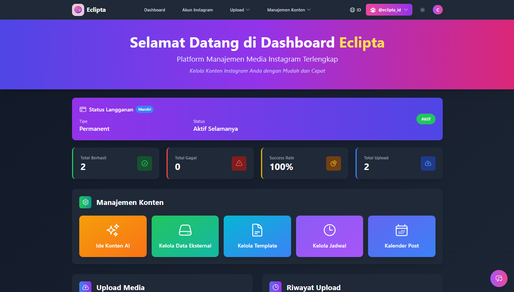
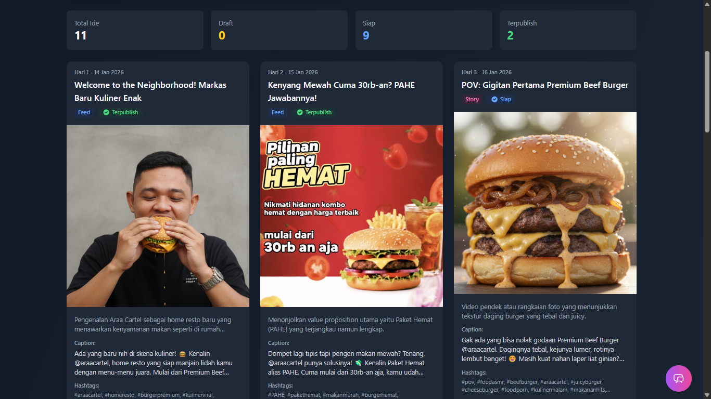
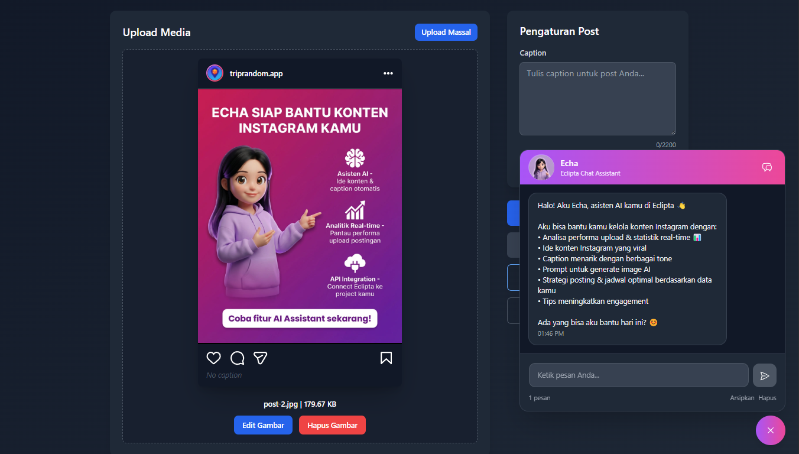

# Eclipta - Manajemen Konten Canggih

**Eclipta** adalah aplikasi manajemen Instagram lengkap yang menggabungkan kecerdasan buatan (AI), editor desain, dan sistem posting otomatis. Kamu bisa melakukan semuanya—mulai dari mencari ide, mendesain, hingga menjadwalkan postingan—cukup di satu tempat tanpa perlu pindah aplikasi.

Aplikasi ini dirancang untuk mengatasi masalah repetitif dalam pengelolaan media sosial, membantu pengguna menghemat waktu hingga **70%** dan menargetkan peningkatan *engagement* hingga **2x lipat** melalui konsistensi posting dan bantuan AI.

---

## Screenshots

### 1. Dashboard Overview

### 2. Ide Konten & AI Generator

### 3. Upload Post Feed

---

## Fitur Unggulan (Key Features)

Eclipta menyediakan ekosistem lengkap mulai dari manajemen user perusahaan, pembuatan ide, desain visual, hingga eksekusi posting otomatis.

### 1. Manajemen Akun & Skabilitas Enterprise
* **Struktur User Skala Enterprise:** Mendukung hierarki user yang cocok untuk perusahaan skala besar. Tersedia role **Admin** yang berfungsi memanajemen akun **Client**. Ini memungkinkan perusahaan membuat akun Client terpisah untuk setiap divisi/cabang mereka.
* **Manajemen Multi-Akun:** Memberikan fleksibilitas bagi Client untuk menghubungkan dan mengelola beberapa akun Instagram sekaligus dalam satu dashboard terpusat.
* **Instagram Graph API:** Integrasi menggunakan jalur resmi (Official API) menjamin keamanan akun.

### 2. Ekosistem Developer
* **Akses API Key Client:** Fitur *developer-friendly* di mana setiap Client bisa men-generate **API Key** unik. Ini memungkinkan user yang memiliki keahlian teknis untuk menghubungkan akun Instagram yang terdaftar di Eclipta ke aplikasi eksternal atau *project* mereka sendiri.

### 3. Publikasi & Penjadwalan Cerdas
* **Dukungan Multi-Format:** Mendukung upload penuh untuk **Post Feed**, **Story**, dan **Album (Carousel)**.
* **Penjadwalan Tingkat Lanjut:** Penjadwalan konten presisi berdasarkan tanggal dan jam (mendukung pengaturan Timezone).
* **Upload Massal:** User dapat mengunggah banyak konten sekaligus. Sistem dilengkapi fitur *Smart Delay* (jeda 2-60 menit antar postingan) untuk menjaga keamanan akun dan perilaku natural.
* **Tampilan Draft & Kalender:** Visualisasi jadwal konten dalam bentuk kalender interaktif, serta manajemen *Draft* yang fleksibel sebelum konten dipublikasikan.

### 4. Generative AI & Kreativitas
* **Ide Konten Berbasis AI:** Masukkan profil bisnis, dan AI akan membuatkan rencana konten untuk 14 hari ke depan lengkap dengan *Caption*, *Hashtag*, dan strategi *Call-to-Action (CTA)*.
* **Generasi Gambar:** Terintegrasi langsung dengan model AI terkini untuk menciptakan aset visual berkualitas tinggi langsung dari dashboard.
* **Echa (Asisten AI):** Asisten virtual cerdas berbasis chat yang siap membantu user mengelola konten atau menjawab pertanyaan seputar fitur aplikasi secara *real-time*.

### 5. Editor Visual & Otomatisasi Dinamis
* **Editor Template Visual:** Editor *drag-and-drop* mirip Canva. User dapat mengupload *background image*, mengatur posisi teks, dan *styling* elemen visual lainnya.
* **Otomatisasi Dinamis (Cron Job):** Salah satu fitur paling *powerful*. User dapat menghubungkan **External API** (misal: Weather API) ke dalam template.
    * *Skenario:* Sistem secara otomatis mengambil data cuaca terkini, memasukkannya ke template desain yang sudah dibuat, me-render gambar baru, dan mempostingnya ke story/feed secara otomatis sesuai jadwal/trigger yang ditentukan.

### 6. Analitik & Monitoring
* **Riwayat Upload & Log:** Mencatat setiap aktivitas posting dengan detail.
* **Analisis Status Upload:** Memantau status keberhasilan upload. Jika terjadi kegagalan, sistem memberikan log detil untuk memudahkan *troubleshooting*.

---

## 🌐 Official Social Media

Dapatkan informasi update fitur terbaru, tips konten, dan promo Eclipta berikut:

- **Instagram:** [@eclipta_id](https://www.instagram.com/eclipta_id/)
- **Facebook:** [Eclipta](https://web.facebook.com/eclipta.id)

---

## Kontak Developer

Jika tertarik untuk berdiskusi mengenai pengembangan software atau kolaborasi teknis, silakan hubungi saya:

- **GitHub:** [hafiizh10](https://github.com/hafiizh10)
- **Email:** hafiizh10@gmail.com
- **LinkedIn:** [Hafiizh](https://www.linkedin.com/in/zoelva)

---
*© 2026 Eclipta. Developed by Hafiizh.*